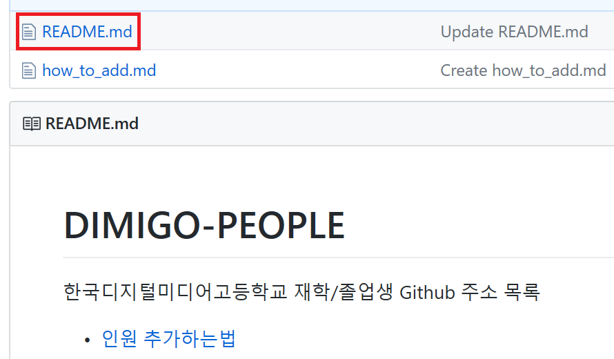
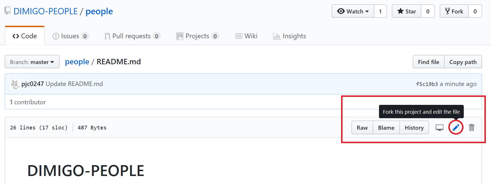
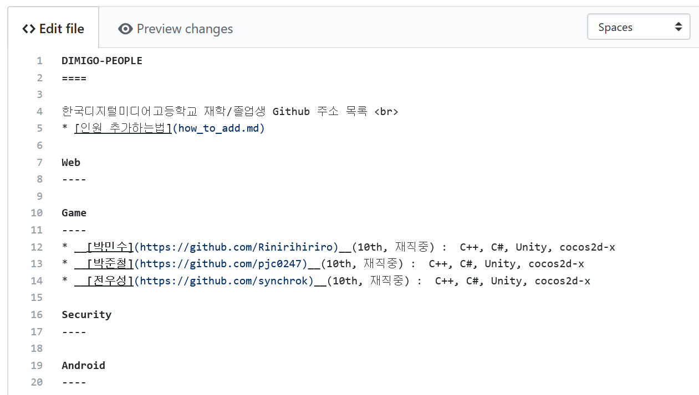
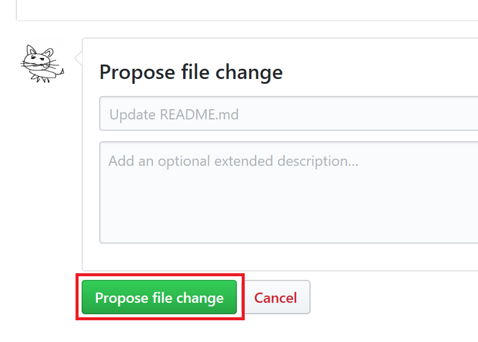

리스트에 사람 추가하기
====
<br><br>

* README.md 파일을 클릭해 해당 페이지로 들어갑니다.
<br><br><br><br><br>


* 오른쪽 상단의 연필 버튼을 클릭해 수정 화면으로 들어갑니다.
<br><br><br><br><br>


* 알맞은 위치에 정보를 적습니다.


```
* __[이름](깃허브주소)__(기수, 재직상태) : 스킬셋
```

* 재직 상태는 `재직중`, `회사이름`, `구직중` 혹은 공란(재학생)으로 작성해 주세요
<br><br><br><br><br>


* `Propse file change` 버튼을 누르면 수정 요청이 전송되고, 승인 이후에 리스트에 추가됩니다.
